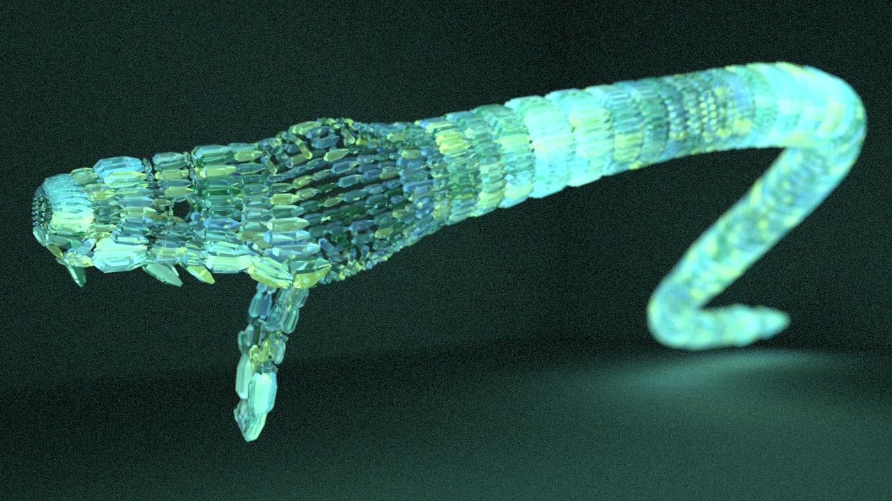

## Make a python out of Python

Used for dismantling an existing mesh, extracting directional vectors
from each face, duplicating a target object and  orienting duplicates
of the target object along the directional vector.

The following render shows the end result of the script (background is noisy due to reduced 
sampling/faster render)

Run scripts in this order:
1. MAIN_loop_faces.py   (change match and copy_template variables) Dismantles the mesh and orients copied objects along vectors
2. renumber_by_distance.py  (change target and axis variables) Renumber your target objects according to their position on the specified axis.
3. keyframe_trace.py    (change target variable) Make your objects invisible then sequentiall visible (1 object per frame)